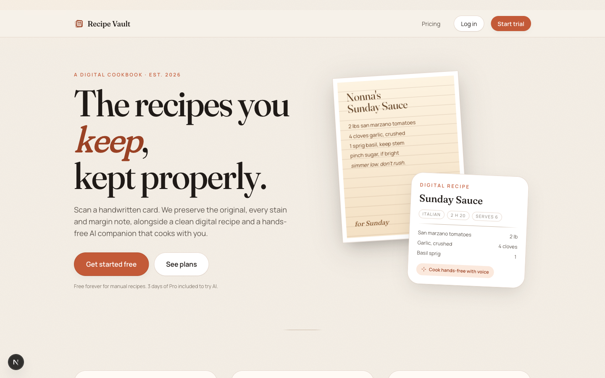
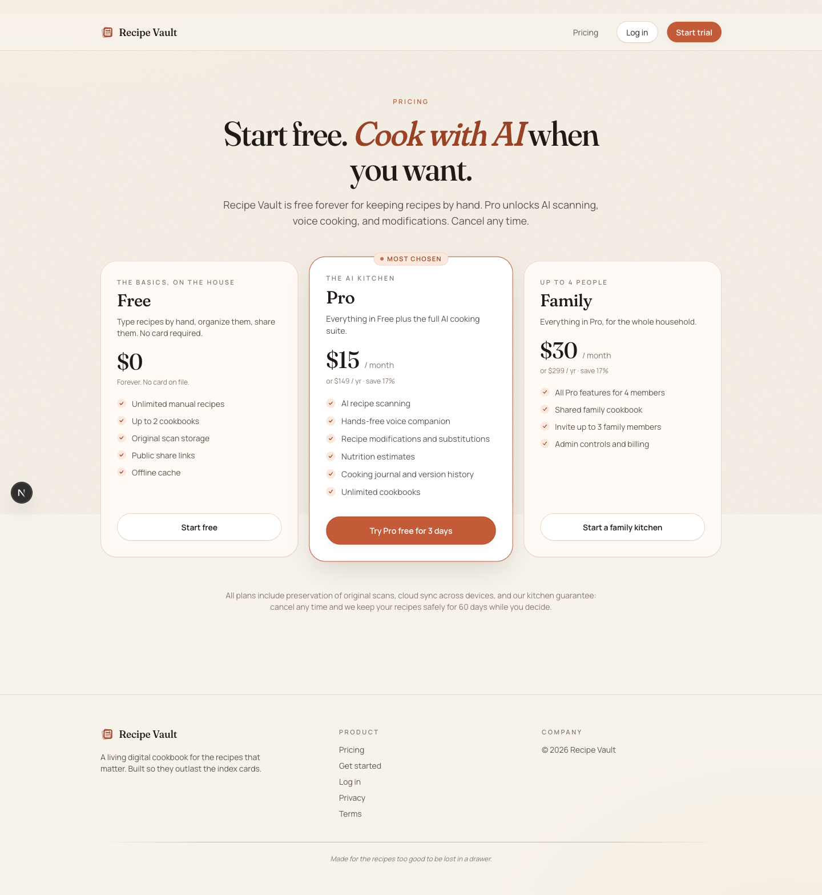
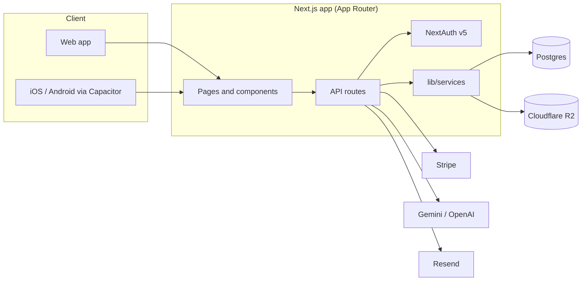

# Recipe Vault

> Turn family recipes, handwritten cards, and scanned cookbook pages into a living digital cookbook you can cook from, hands-free.


Recipe Vault preserves the original scan of a recipe alongside a clean, structured
digital version. You can organize recipes into cookbooks, keep a cooking journal,
track modifications over time, and cook with a real-time AI voice companion.



---

## Features

- **Scan and preserve.** Capture handwritten cards and cookbook pages. The original
  image is always kept in object storage next to the parsed, structured recipe.
- **AI cooking companion.** Hands-free, voice-guided cooking powered by speech-to-text,
  a language model, and text-to-speech.
- **Tried This journal.** Log each cook with notes, ratings, photos, and the tweaks
  you made, with full version history.
- **Cookbooks and family sharing.** Organize into cookbooks and share a cookbook with
  up to four family members.
- **Works offline.** Cached recipes and a step-by-step text cooking mode work without
  a connection.

## Screenshots

Free forever for keeping recipes by hand, with a full-access trial and paid tiers that unlock the AI features.



## Architecture

Recipe Vault is a single Next.js application (web and API) backed by Postgres and
object storage, with third-party services for payments, email, and AI.



Key design choices:

- **One deployable app.** The web UI and the API live in the same Next.js project, so
  long-lived voice and streaming connections are not constrained by serverless timeouts.
- **Ownership enforced in code.** There is no row-level security. Every query is scoped
  to the authenticated user through shared data-access helpers, and every API route runs
  behind a single `withAuth` wrapper.
- **Original scans are never thrown away.** Uploads go to object storage; the database
  stores references plus the parsed recipe.

See [docs/ARCHITECTURE.md](docs/ARCHITECTURE.md) for request, auth, and data-model diagrams.

## Tech stack

| Area | Choice |
| --- | --- |
| Framework | Next.js 16 (App Router), React 19, TypeScript (strict) |
| Styling | Tailwind CSS |
| State | Zustand |
| Database | Postgres 16 with Drizzle ORM |
| Auth | NextAuth (Auth.js v5): email/password, Google, Apple |
| Payments | Stripe (web) and RevenueCat (native) |
| Storage | Cloudflare R2 (S3-compatible) |
| AI | Gemini for OCR and chat, OpenAI for voice (STT/TTS) |
| Email | Resend |
| Mobile | Capacitor |

## Quick start

### With Docker (app plus Postgres)

```bash
cp .env.example .env      # fill in the values you have
docker compose up --build
```

The app comes up on `http://localhost:3000`. The compose file points the app at a
local Postgres instance automatically.

### Local development

```bash
nvm use                   # Node 20 (see .nvmrc)
cp .env.example .env
npm ci
npm run db:migrate        # apply Drizzle migrations
npm run db:seed           # optional sample data
npm run dev
```

## Configuration

All configuration is via environment variables. Copy `.env.example` to `.env` and fill
it in. The app needs, at minimum, `DATABASE_URL` and `NEXTAUTH_SECRET`; AI, payments,
storage, and email features each require their own keys, documented in `.env.example`.

## Project structure

```
src/
  app/
    (marketing)     Public landing, pricing, legal, public recipes
    (auth)          Login, signup, password reset
    (app)           Authenticated app: recipes, cookbooks, scan, cook, settings
    api/            API routes (thin handlers over lib/services)
  components/       UI and feature components
  lib/
    config/         Plans, limits, trial, pricing (single source of truth)
    services/       Business logic and data access
    middleware/     withAuth, feature gating, rate limiting, AI limits
    db/             Drizzle schema and client
drizzle/            SQL migrations
scripts/            Seed, cron jobs, Stripe setup helpers
```

## Testing and checks

```bash
npm run lint
npx tsc --noEmit
npm run test
```

CI runs the same set on every push and pull request.

## Deployment

See [docs/DEPLOYMENT.md](docs/DEPLOYMENT.md). The app builds to a standalone server
(`output: "standalone"`) and ships with a `Dockerfile`, so it runs anywhere that can run
a container plus Postgres and object storage.

## Contributing

Contributions are welcome. See [CONTRIBUTING.md](CONTRIBUTING.md) for setup, conventions,
and the checks to run before opening a pull request.

## License

Licensed under the [Apache License 2.0](LICENSE). The code is open source; the Recipe
Vault name and logos are not covered by the license.
