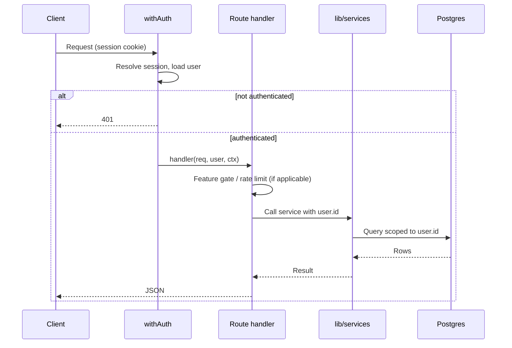
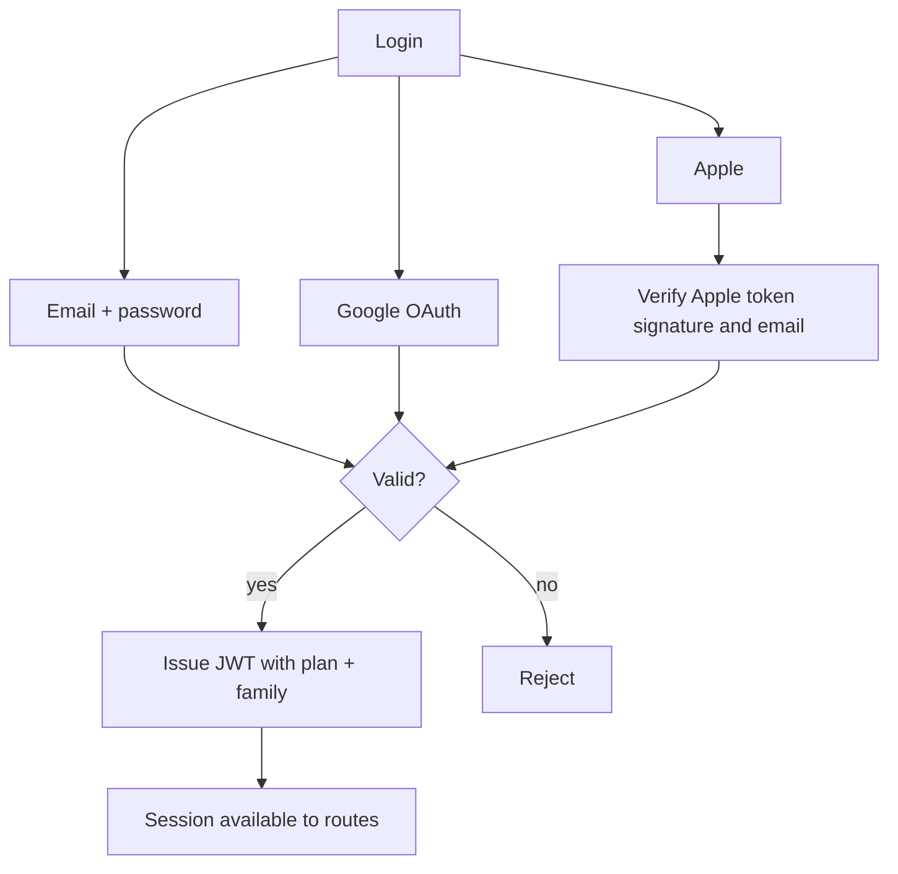
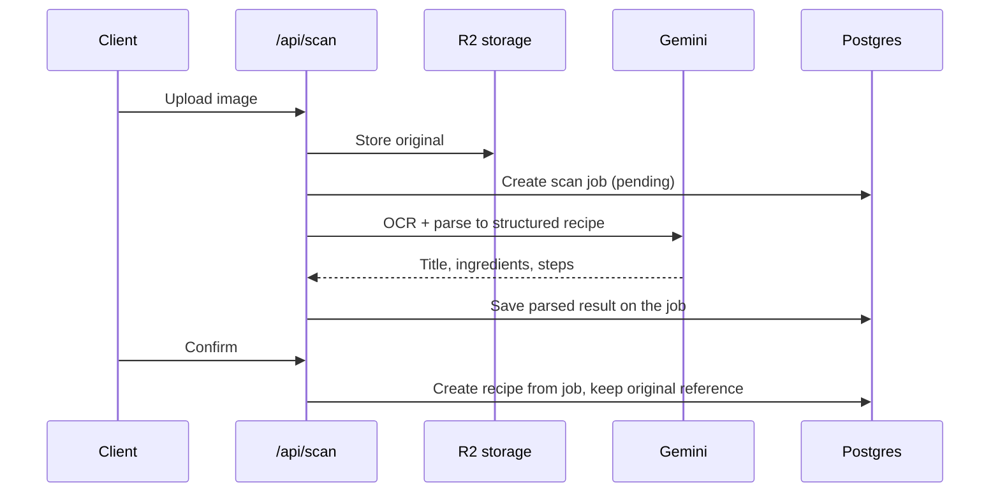
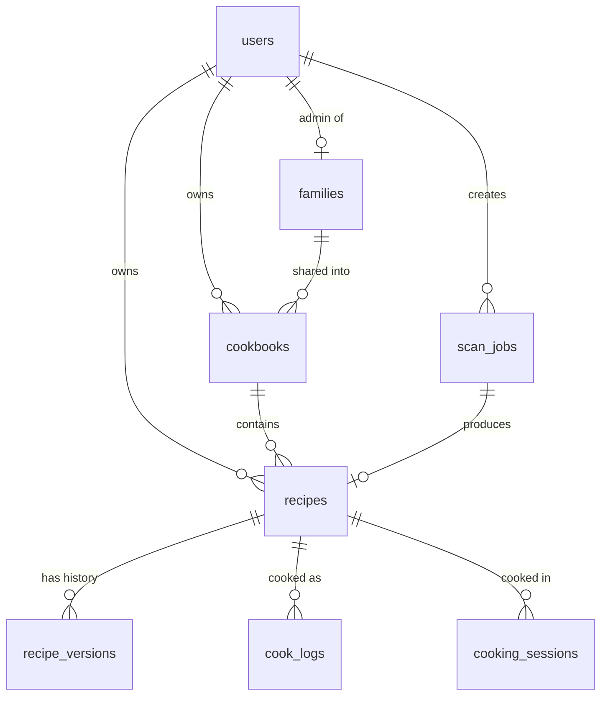
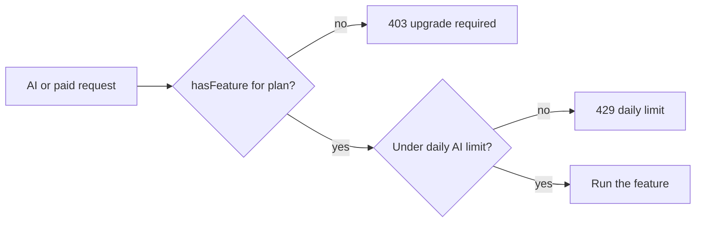

# Architecture

This document explains how Recipe Vault is put together: the request lifecycle,
authentication, the scan pipeline, the data model, and how plans are enforced.

## Overview

Recipe Vault is one Next.js application that serves both the web UI and the API.
Business logic lives in `lib/services`; API route handlers are thin and run behind a
shared `withAuth` wrapper. State is stored in Postgres (via Drizzle) and Cloudflare R2.

## Request lifecycle

Every authenticated API route is wrapped with `withAuth`, which resolves the session,
loads the user, and passes it to the handler. Feature gates and rate limits run inside
the handler where needed.

## Authentication

NextAuth (Auth.js v5) issues a JWT session and stores plan and family data on the token.
Three providers are supported.

Native Apple sign-in verifies the identity token against Apple's public keys and only
trusts the email claim from the verified token, never a client-supplied value.

## Data isolation

There is no database row-level security. Isolation is enforced in application code:

- Every query is scoped by the authenticated `user.id`.
- Ownership is re-checked before any update or delete.
- Family-shared recipes are only reachable when the user has a `family_id`.

This keeps the rules explicit and testable, at the cost of requiring discipline in the
service layer. The shared helpers in `lib/services` and `lib/middleware` centralize it.

## Scan pipeline

Scanning turns a photo into a structured recipe. The original image is preserved.

## Data model

The core tables and their relationships.

## Plans and feature gating

Plan entitlements, limits, the trial length, and pricing live in one client-safe module,
`src/lib/config/plans.ts`. Server routes read from it so the UI and the API never drift.

New accounts start on a full-access trial. When the trial ends the account moves to the
free plan (manual recipes, limited cookbooks, no AI); paid plans unlock AI, cook logs,
version history, unlimited cookbooks, and family sharing.
